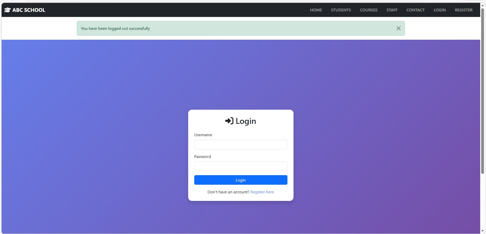
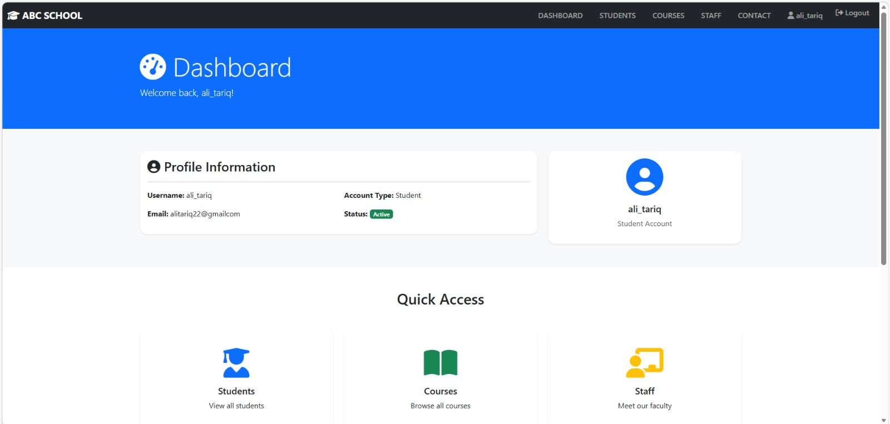
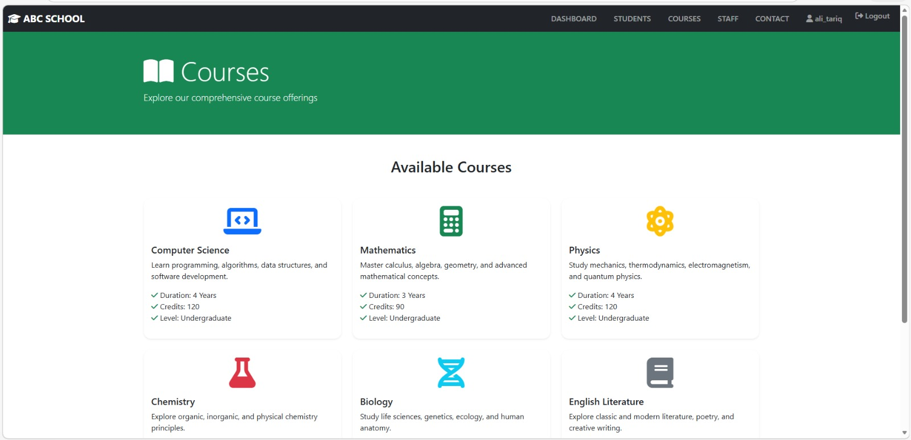
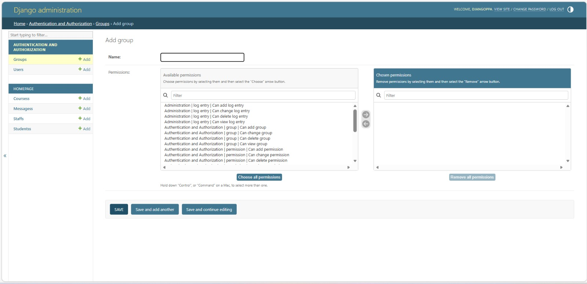

# Django School Portal Web Application

This project is a **School Portal Web Application** built using the **Django web framework**.
The system allows students to register, log in, and access a **student dashboard** where they can view courses and school information.

An **admin panel** is also available to manage data such as courses, staff, and users.

This project was developed as part of learning **Python and Django web development**.

---

## Features

- User Registration System
- Login and Logout Authentication
- Student Dashboard
- Course Information Display
- School Staff Information Page
- Django Admin Panel for Data Management
- Template-based Frontend using Django Templates
- Static Files Support (CSS, Images)
- SQLite Database Integration

---

## Technologies Used

- Python
- Django
- HTML
- CSS
- SQLite
- Git & GitHub

---

## Project Structure

MYDJANGOPROJECT
│
├── homepage/ (Django Application)
│ ├── migrations/
│ ├── static/
│ ├── admin.py
│ ├── apps.py
│ ├── models.py
│ ├── urls.py
│ └── views.py
│
├── myproject/ (Django Project Settings)
│ ├── settings.py
│ ├── urls.py
│ ├── asgi.py
│ └── wsgi.py
│
├── templates/
├── manage.py
├── requirements.txt
└── README.md

---

## Installation and Setup

Follow these steps to run the project locally.

### 1. Clone the repository

git clone https://github.com/iffatadnann/django-webapp-project.git

### 2. Navigate into the project directory

cd myproject

### 3. Create a virtual environment

python -m venv venv

### 4. Activate the virtual environment

Windows:

venv\Scripts\activate

### 5. Install required dependencies

pip install -r requirements.txt

### 6. Apply database migrations

python manage.py migrate

### 7. Run the development server

python manage.py runserver

### 8. Open the project in your browser

http://127.0.0.1:8000/

---

## Admin Panel

Django provides a built-in admin panel for managing the application data.

Create a superuser:

python manage.py createsuperuser

Then access the admin panel at:

http://127.0.0.1:8000/admin/

---

## Screenshots

### Login Page

### Student Dashboard

### Courses Page

### Admin Panel

---

## Future Improvements

- Course enrollment system
- Student profile management
- Attendance tracking
- Improved user interface

---

## Author

This project was developed as part of learning **Python and Django Web Development**.
